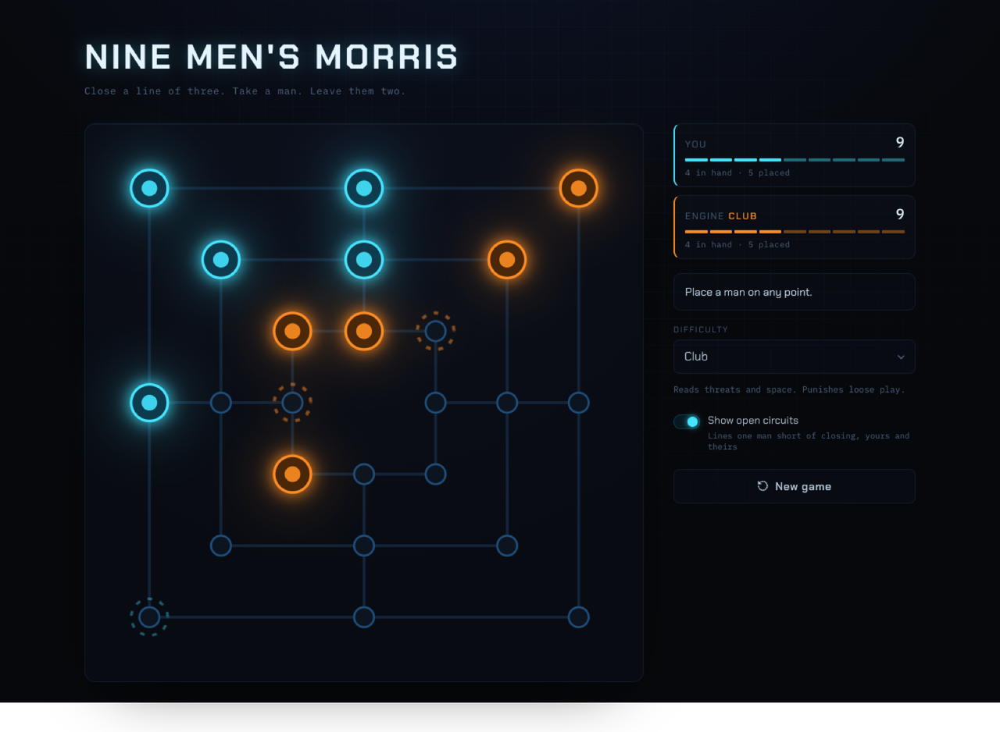
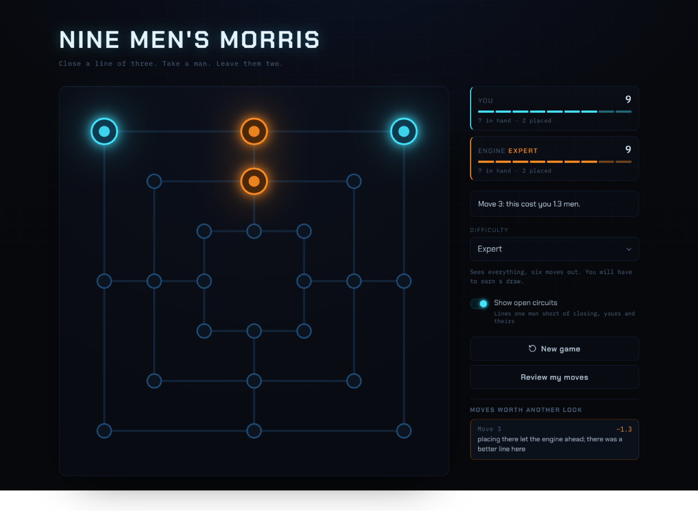

# Nine Men's Morris

A place to **learn nine men's morris and practice it** — a game older than chess
that most people have never played — against an opponent that scales from one
that misses your mills to one that cannot lose. Play it at
**[9mm.ljs.app](https://9mm.ljs.app)**.



**The board teaches while you play.** Two of your men on a line with the third
point open is a mill one move from closing — and the board says so: your
near-mills glow cyan, the opponent's glow amber, so you read a threat before it
lands. In the shot above there's a cyan opening at the bottom-left corner and
two amber threats waiting to be answered. Pick up a man and every square it can
reach lights up; the phase and flying rules are shown, never recited.

**Five opponents, and they differ in what they _understand_, not just how deep
they look.** That is what makes the low rungs feel like beginners rather than
broken bots — they play sensible-looking moves and miss the point, which is what
you can actually learn against.

- **Learner** — counts men; won't see your mill coming
- **Casual** — takes mills it's handed; doesn't build toward them
- **Club** — reads threats and space; punishes loose play
- **Expert** — sees everything, six moves out; you'll earn your draw
- **Impossible** — thinks for a second and doesn't lose

**Lose, and find out why.** Review reads the whole game back with a strong
engine and flags the moves that cost you — how much each gave up, in men — so a
loss turns into the next thing to work on.



## Run it

```sh
npm install
npm run dev        # http://localhost:5173
npm test           # 87 tests
npm run typecheck
npm run calibrate  # measure the difficulty ladder (see below)
```

## The game

Three concentric squares, 24 points, 16 possible lines of three. Nine men each.
Place them, then slide them along the traces; close a line of three (a **mill**)
and take an enemy man. Reduce someone to two men, or leave them with no legal
move, and they lose. At exactly three men a player may **fly** to any empty
point.

The one rule everybody gets wrong: a man inside a mill is protected — unless
every one of that player's men is in a mill, at which point the protection
lapses.

Gasser solved the game in 1993. **With perfect play it is a draw.** That is why
the top tier promises only that it will not lose: against it, a draw is the win.

## Layout

```
src/engine/     pure, no DOM, 87 tests
  types.ts        vocabulary — depends on nothing
  board.ts        topology: 24 points, 32 edges, 16 mills
  zobrist.ts      position hashing (53-bit, no BigInt)
  rules.ts        move generation, legality, endings  <- public face
  eval.ts         evaluation, and the knowledge tiers
  search.ts       negamax, alpha-beta, TT, killers, iterative deepening
  difficulty.ts   the five rungs
src/worker/     search off the main thread
src/ui/         SVG board
scripts/        calibration harnesses
```

Dependency order is strict: `types -> board -> zobrist -> rules -> eval ->
search -> difficulty`. `rules.ts` re-exports `types`, so callers import from
`rules` and get everything.

## How difficulty is built

Strength comes from three independent knobs, not from search depth alone:

| Tier | Sees | Depth | Noise |
|---|---|---|---|
| Learner | men only | 1 | 1.0 |
| Casual | + mills | 2 | 0.4 |
| Club | + threats, mobility | 5 | 0.1 |
| Expert | + double mills | 6 | 0 |
| Impossible | everything | ~1.5s of iterative deepening | 0 |

**Weak tiers understand less; they do not play randomly.** A depth-1 bot is not
a beginner — it moves arbitrarily in quiet positions yet pounces perfectly on
any capture, which reads as broken rather than weak. Taking away *knowledge*
(the zero weights in `eval.ts`) produces something that plays sensible-looking
moves and misses the point, which is what a human beginner looks like and what
you can actually learn against.

Noise is a softmax over root scores, expressed in men: temperature 1.0 means a
move about one man worse than best still gets picked reasonably often. It drifts
toward *plausible* mistakes rather than uniform ones.

### Calibrating

`npm run calibrate` plays each rung against the one below it:

```
Casual      over Learner     24W 0L 0D   score 100%
Club        over Casual      24W 0L 0D   score 100%
Expert      over Club        16W 0L 8D   score  83%
Impossible  over Expert      15W 3L 6D   score  75%
```

`npm run tournament` runs the full round-robin. The ladder is monotonic — every
rung beats every rung beneath it.

The bottom two gaps read as 100%, and that is left deliberately. Five rungs
cannot both span "just learned the rules" to "cannot lose" *and* keep gentle
steps between neighbours; engine-vs-engine score rate is also the wrong yardstick
down there, where the opponent is a human who has played four games. The rungs
that matter for a human's ceiling — Club, Expert, Impossible — are spaced well.

## Notes for future work

**Search.** ~550k nodes/sec, effective branching factor ~3.3. A 1.5s budget
reaches depth ~11 in the moving phase but only ~7 while placing, where the
branching factor is 24. The placing phase decides most games, so an opening book
is the highest-value improvement available. `hashPosition` is recomputed per
node; making it incremental in `make`/`unmake` is the next cheapest win.

**`exactRoots`.** Alpha-beta only ever proves the *best* root score — every
other move fails low and returns an upper bound. Anything that reads the numbers
rather than just playing the top move (the difficulty softmax, the post-game
review) must pass `exactRoots: true` or it is sampling from noise. This was a
real bug: it made a depth-6 tier lose to a depth-2 tier.

**Atomic moves.** A capture is part of the move (`{from, to, remove}`), not a
follow-up state, so the game tree stays strictly alternating and search never
models one player acting twice. The cost lands in the UI, which *does* need the
half-step: see `previewOf` in `main.ts`, without which the board shows an empty
point where you just placed a man.

**Visual grammar.** Solid ring = you can act on this point. Dashed ring = a mill
here is one man away. Breaking that rule makes cyan threat hints vanish into a
field of cyan legal-move rings. Cyan/amber over the reflexive cyan/magenta
because blue/orange survives deuteranopia and protanopia, and "which men are
mine" is the one question a player cannot afford to get wrong.

**Not built yet.** Choosing sides (you are always cyan and move first);
persisting difficulty between sessions; an adaptive tier; move-list notation in
the review, which currently locates a move by lighting the board rather than
naming a square.

## License

MIT — see [LICENSE](LICENSE).
